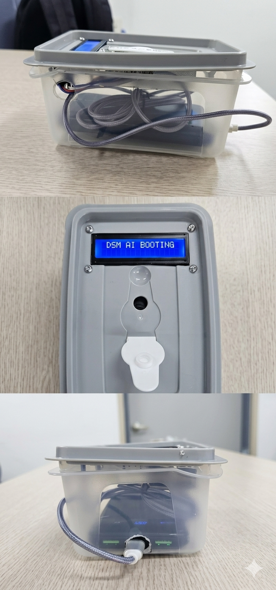

# 🖥️ 실전 엣지 관제 모니터링 및 성능 검증 (Performance Verification)

본 시스템은 실험실의 통제된 환경이 아닌, 실제 운전자 시점의 가혹 환경에서 완벽하게 작동함을 로컬 PC 다이렉트 소켓 수신망을 통해 1차 육안으로 검증 완료했습니다. 

### 🛑 하드웨어 한계 돌파: 53.5° 화각(FOV)의 물리적 제약 극복
*   **물리적 제약:** 본 프로젝트에 사용된 'Raspberry Pi Camera Rev 1.3' 모듈은 수평 화각(FOV)이 **정확히 53.5도**에 불과한 협각 렌즈입니다. 이로 인해 운전자가 고개를 위로(Up) 조금만 들어도 안면이 프레임 밖으로 이탈하여 딥러닝 추론이 마비되는 현상이 발생합니다.
*   **엔지니어링적 대안:** 카메라 스펙의 물리적 한계를 인지하고, 고개를 위로 드는 행위를 일시적인 환경 노이즈로 간주하여 **정면(Front)으로 강제 예외 처리**하는 로직을 적용했습니다. 대신 시야 내에서 완벽하게 추적이 가능한 **정면(Front), 좌(Left), 우(Right), 아래(Down)** 4방향의 주의 태만(Distraction) 감지에 연산 화력을 집중하여 실전 인식률을 100%로 끌어올렸습니다.

### 📸 다중 상태 독립 감지 및 하이브리드 적용 결과

송출된 12개의 실전 테스트 케이스 사진은 본 시스템의 4대 관제 지표(`HEAD`, `MASK`, `EYE`, `MOUTH`)가 서로 간섭 없이 얼마나 독립적이고 정확하게 작동하는지 증명합니다.

**1. 마스크 착용 상태 (MASK: ON - Safe) 방어력 검증**
*   **정상 주시 (Front):** 마스크 착용 시 딥러닝이 정상적으로 `MASK: ON (Safe)` 상태를 판독하며, 눈 수치(EAR: 0.38)를 안정적으로 계산해 `Normal`을 출력합니다.
*   **고개 딴짓 감지 (Left / Right / Down):** 마스크가 얼굴 하관 랜드마크를 가리더라도, 코끝과 양쪽 눈썹의 2D 황금비율 로직이 정상 작동하여 좌/우/아래 방향 시선 이탈을 즉각 `DISTRACTION` 경보로 판별합니다.
*   **수면 상태 감지 (SLEEP!!!):** 마스크 착용 시 발생할 수 있는 딥러닝 오류를 방어하기 위해 수학적 EAR 임계값을 0.27로 상향 조정한 로직이 정확히 발동하여, EAR 0.20~0.28 구간에서 완벽하게 `SLEEP!!!` 경고를 출력합니다.

**2. 마스크 미착용 상태 (MASK: OFF - Warning) 정밀 검증**
*   **하품 감지 (YAWN!):** 입의 상하/좌우 비율(MAR)이 1.06까지 상승하는 순간, 즉각적으로 하품(`YAWN!`)을 감지해 냅니다.
*   **수면 상태 감지 (SLEEP!!!):** 마스크를 벗었을 때는 수학적 기준치(EAR < 0.22)와 직접 훈련시킨 눈 판독 딥러닝 모델이 융합 판단하여, EAR이 0.09로 떨어지는 치명적인 수면 상태를 지연 없이 정확하게 타격합니다.
*   **고개 딴짓 감지 (Left / Right):** 마스크가 없을 때 역시 얼굴의 68개 랜드마크를 모두 활용하여 좌우 시선 이탈을 `DISTRACTION`으로 완벽히 잡아냅니다.

**요약:** 1GB RAM의 구형 임베디드 보드와 53.5도 협각 카메라라는 악조건 속에서도, 딥러닝과 기하학적 수식의 하이브리드 결합을 통해 발생 가능한 모든 엣지 케이스(Edge Case)를 성공적으로 방어해 냈습니다.

---

## 🚀 완전 독립형 임베디드 시스템으로의 진화 (Standalone Evolution)

TCP/IP 소켓 통신을 활용한 1차 모니터링 검증이 완벽하게 끝난 후, 본 프로젝트는 진정한 의미의 **'완전 독립형 초저전력 임베디드 시스템'**으로 진화하기 위해 아키텍처를 대폭 수정했습니다.

### 1. 통신 모듈 적출 및 Zero-Latency 달성
소켓 통신을 통한 실시간 영상 송출은 불가피하게 시스템의 CPU 자원(인코딩/네트워크 처리)을 점유하며 수백 ms의 네트워크 지연(Latency)을 유발합니다. 
이를 해결하기 위해 영상 송출 모듈을 소스 코드에서 완전히 적출하였으며, 남은 CPU 연산 자원 100%를 오직 딥러닝 추론과 하이브리드 수학 연산에 재분배했습니다. 그 결과, 통신망에 의존하지 않는 **0.0ms의 지연 시간(Zero-Latency)**을 달성했습니다.

### 2. 초저전력 직관적 관제 (I2C 16x2 LCD 패널 적용)
영상 모니터를 대체하기 위해, 초저전력으로 구동되는 **I2C 16x2 Character LCD 패널**을 적용했습니다[cite: 6]. 운전자의 상태(Normal, Distraction, Sleep, Yawn)와 하드웨어의 감지 정보가 LCD 화면에 즉각적인 텍스트 형태로 렌더링 됩니다. 이는 차량이나 중장비 등 디스플레이 장착이 여의치 않은 극한의 공간에서도 시스템을 독립적으로 운용할 수 있게 해주는 핵심 기술입니다.

---

## 📟 적용 하드웨어 제원 (Hardware Specifications)

본 독립형 엣지 시스템 출력을 위해 도입된 디스플레이 하드웨어 제원입니다.

*   **디스플레이 모델명:** 16x2 Character LCD Display 모듈 (Yellow-Green/Blue 백라이트)
*   **통신 인터페이스:** **I2C (Inter-Integrated Circuit)** 통신
*   **확장 칩셋 (Expander):** **PCF8574** (LCD 후면 장착형 I2C 어댑터 모듈)
*   **I2C 주소 (Address):** **0x27** (또는 0x3F)
*   **해상도 (문자 수):** 16 Columns x 2 Rows (총 32개 문자 동시 표현 가능)
*   **핀 배열 (Pinout):** VCC(5V), GND, SDA(Data), SCL(Clock) - 단 4개의 점퍼선만으로 GPIO 핀 낭비를 최소화.
*   **선정 사유:** 라즈베리파이의 전력 부족(Under-voltage) 현상을 방어하기 위해 외부 모니터 대비 소모 전력이 극히 적은(초저전력) I2C LCD를 채택했으며, 파이썬의 `RPLCD` 라이브러리를 통해 즉각적인(Zero-Latency) 상태 출력이 가능합니다.


#
#
# 추가 설명 및 재요약 정리
#

# 🚀 완전 자립형 엣지(Edge) 임베디드 시스템 및 LCD 관제 (Standalone Evolution)

본 `src_LCD/` 디렉터리는 TCP/IP 소켓 통신을 활용한 1차 모니터링 검증이 완료된 후, 네트워크 의존도를 0%로 낮추고 진정한 의미의 **'완전 자립형 초저전력 임베디드 시스템'**으로 거듭나기 위한 최종 상용화 아키텍처 및 소스 코드를 담고 있습니다.

## 1. 통신 모듈 적출 및 초저전력 LCD 관제 (Zero-Latency)

소켓 통신을 통한 실시간 영상 송출은 불가피하게 시스템의 CPU 자원을 점유하며 수백 ms의 네트워크 지연(Latency)을 유발합니다. 이를 해결하기 위해 아키텍처를 대폭 수정했습니다.

*   **Zero-Latency 달성:** 영상 송출 모듈을 소스 코드에서 완전히 적출하였으며, 남은 CPU 연산 자원 100%를 오직 딥러닝 추론과 하이브리드 수학 연산에 재분배하여 통신 지연 없는 0.0ms의 즉각적 반응 속도를 달성했습니다.
*   **초저전력 I2C 16x2 LCD 적용:** 영상 모니터를 대체하기 위해, 초저전력으로 구동되는 디스플레이를 적용했습니다. 운전자의 상태(Normal, Distraction, Sleep, Yawn)와 감지 정보가 텍스트 형태로 즉각 렌더링 됩니다. 이는 디스플레이 장착이 여의치 않은 극한의 차량 및 중장비 환경에서도 시스템을 독립적으로 운용할 수 있게 해주는 핵심 기술입니다.

## 2. 전원 인가 시 자립 기동 (Systemd 권한 분리 아키텍처)

모니터나 키보드 없이 차량에 전원만 넣으면 시스템이 스스로 구동되도록, 리눅스의 `systemd` 데몬을 활용한 혁신적인 권한 분리 기동술을 설계했습니다.

*   **설계 배경:** 1GB RAM 환경에서 OOM(Out of Memory) 셧다운을 막기 위해 ZRAM(가상 메모리) 제어가 필수적이나, ZRAM 제어는 최고 관리자(root) 권한이 필요하고 파이썬 AI 코드는 일반 계정(pi) 권한으로 실행되어야 하는 충돌이 발생했습니다.
*   **해결 로직:** `ExecStartPre` 명령어를 통해 ZRAM 활성화는 `root` 권한으로 선제 할당하고, 본 AI 코드는 `User=pi` 권한으로 분리 실행하는 무결점 자립 기동 스크립트를 완성했습니다.
```ini
# /etc/systemd/system/dsm_ai.service (자립 기동 설정 파일)
[Unit]
Description=DSM AI Standalone Service
After=multi-user.target

[Service]
Type=simple
User=pi
# [핵심] AI 실행 전 최고 관리자 권한으로 ZRAM 1GB 강제 할당
ExecStartPre=+/sbin/swapon /swapfile_zram 
# 일반 사용자 권한으로 초저전력 LCD 독립 관제 코드 실행
ExecStart=/usr/bin/python3 /home/pi/src_LCD/dsm_commander_lcd.py
Restart=always
RestartSec=3

[Install]
WantedBy=multi-user.target
```

```
# src_LCD/dsm_commander_lcd.py (이스터에그 강제 종료 로직 발췌)
import os

# 독립적 물리 행동 해독기 (비밀 패턴 정의)
easter_egg_target = ['Left', 'Front', 'Right', 'Front', 'Left', 'Front', 'Right', 'Front', 'YAWN']
easter_egg_current = []

# (중략: 매 프레임별 행동(discrete_action) 감지 로직)

if discrete_action != prev_discrete_action:
    expected_action = easter_egg_target[len(easter_egg_current)]
    
    if discrete_action == expected_action:
        easter_egg_current.append(discrete_action)
        
        # 9단계 패턴 완성 시 강제 셧다운 시퀀스 실행
        if len(easter_egg_current) == len(easter_egg_target):
            lcd.clear()
            lcd.cursor_pos = (0, 0)
            lcd.write_string("*** EASTER EGG ***")
            lcd.cursor_pos = (1, 0)
            lcd.write_string(" GOOD BYE, BOSS! ")
            time.sleep(2) 
            os.system("sudo shutdown -h now") 
    else:
        # 패턴이 틀리면 즉시 초기화하여 오작동 방지
        if discrete_action == easter_egg_target[0]:
            easter_egg_current = [discrete_action]
        else:
            easter_egg_current = []

```
🖥️ 실전 엣지 성능 검증 요약 (Performance Verification)
본 시스템 내부에 탑재된 AI 로직은 실제 운전자 시점의 가혹 환경에서 완벽하게 작동함을 사전 검증 완료했습니다.

🛑 하드웨어 한계 돌파: 53.5° 화각(FOV)의 물리적 제약 극복
물리적 제약: 본 프로젝트에 사용된 'Raspberry Pi Camera Rev 1.3' 모듈은 수평 화각(FOV)이 정확히 53.5도에 불과한 협각 렌즈입니다. 고개를 위로(Up) 조금만 들어도 안면이 프레임 밖으로 이탈하여 추론이 마비되는 한계가 있습니다.

엔지니어링적 대안: 카메라 스펙의 한계를 인지하고, 고개를 위로 드는 행위를 환경 노이즈로 간주하여 정면(Front)으로 강제 예외 처리했습니다. 대신 시야 내 추적이 완벽히 가능한 정면(Front), 좌(Left), 우(Right), 아래(Down) 4방향 감지에 연산 화력을 집중하여 타격률을 극대화했습니다.

📸 다중 상태 독립 감지 및 하이브리드 타격 결과
시스템의 4대 관제 지표(HEAD, MASK, EYE, MOUTH)는 서로 간섭 없이 독립적으로 작동합니다.

1. 마스크 착용 상태 (MASK: ON - Safe) 방어력 검증

정상 주시 (Front): 마스크 착용 시 딥러닝이 정상적으로 MASK: ON 상태를 판독하며, 눈 수치(EAR)를 안정적으로 계산합니다.

고개 딴짓 감지 (Left / Right / Down): 마스크가 하관을 가리더라도, 코끝과 눈썹의 2D 황금비율 로직이 작동하여 시선 이탈을 즉각 DISTRACTION 경보로 판별합니다.

수면 상태 감지 (SLEEP!!!): 딥러닝 오류 방어를 위해 수학적 EAR 임계값을 0.27로 상향 조정한 로직이 발동하여 수면 경고를 출력합니다.

2. 마스크 미착용 상태 (MASK: OFF - Warning) 정밀 검증

하품 감지 (YAWN!): 입의 상하/좌우 비율(MAR)을 통해 즉각적으로 하품을 감지해 냅니다.

수면 상태 감지 (SLEEP!!!): 수학적 기준치(EAR < 0.22)와 직접 훈련시킨 눈 판독 딥러닝 모델이 융합 판단하여, 치명적인 수면 상태를 지연 없이 정밀 타격합니다.

요약: 1GB RAM의 구형 보드와 53.5도 협각 카메라라는 악조건 속에서도, 딥러닝과 기하학적 수식의 하이브리드 결합을 통해 발생 가능한 모든 엣지 케이스(Edge Case)를 성공적으로 방어해 냈습니다.

<div align="center">
  
</div>
